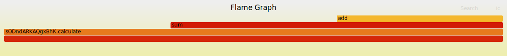

## Common logging code for osbuild projects

Common code for:

* logging initialization
* correlation
* exporting
* tracing

Together with some best practices on how to do logging and tracing in osbuild projects.

### Overview

Without sinking deep into the details of what is in this repo, here is a summary of what are the best practices for osbuild projects. Note these project were already configured with these libraries and use provided functionality like middleware, HTTP client wrappers, context passing or exporting logs and traces so you do not need to worry about any of it.

For all logging use `log/slog` from the standard library. Note there are not formatting functions available as `slog` is purely structured logging library. Instead of this:

```go
logger.Infof("user with ID %d was authenticated", user.ID)
```

write this:

```go
slog.Info("user was authenticated", "user_id", user.ID)
```

or better this:

```go
slog.InfoContext(ctx, "user was authenticated", "user_id", user.ID)
```

You do not need to know much about `slog` other than it provides four logging functions (levels) and you can optionally provide zero or more key-value pairs. It is possible to create groups (sub-fields) with `WithGroup` or `slog.Group` attribute, instantiate logger using `With` functions and further optimize attribute creation but this is only useful when dealing with many logging statements (e.g. in loops). For a normal day to day logging in osbuild project, you do not need any of that. If you still need a good introduction to the library, search the web or [read this short blogpost](https://lukas.zapletalovi.com/posts/2023/about-structured-logging-in-go121/).

Please do all logging with lowercase letters, since the standard practice is to use lowercase for Go errors as well, it works nicely hand in hand. This is useful for error wrapping and you do not need to think about the case anymore.

Always pass `context.Context` down the stack, this allows for automatic log correlation. You do not need to do anything and all log statements will have `trace_id` that can be used for searching in Kibana or Splunk. Example:

```go
// an Echo handler
ctx := c.Request().Context()

// log like this
slog.InfoContext(ctx, "some message")

// pass the context to all functions
doSomething(ctx)
```

Of course, small functions that will unlikely do any logging or call an external service do not need a context.

When echo library is used, an optional echo logging proxy can be used to redirect logs into slog thus echo logging can be kept in use. But prefer structured logging:

```go
echo.Infof("Do not do this: %s", "string")

echo.Infoj("use infoj method instead", map[string]any{"msg": "test"})
```

The library provides trace correlation from HTTP headers, middleware can be used both with plain HTTP handlers or echo library:

```go
middleware := strc.NewMiddleware(logger)
e.Use(echo.WrapMiddleware(middleware))
```

Trace correlation information can be easily passed into other services using a simple HTTP decorator:

```go
r, _ := http.NewRequestWithContext(ctx, http.MethodGet, "https://home.zapletalovi.com/", nil)
doer := strc.NewTracingDoer(http.DefaultClient)
doer.Do(r)
```

There is additional package named `strc` which provides simple tracing, use this when you want to be able to tell how much time was spent in specific block of code (e.g. a function). These blocks are called "spans" and are nested, the tracing information carries over to external systems as well, this is all automatic as long as you call osbuild services you do not need to do anything:

```go
span, ctx := strc.Start(ctx, "calculating something big")
defer span.End()
```

Note the `ctx` variable is overwritten by the `Start` function, it is best to overwrite it not creating a copy that can be confusing:

```go
span, ctx2 := strc.Start(ctx, "calculating something big")
defer span.End()

doSomething(ctx) // wrong, should be ctx2
```

These are all the basics.

Further information about individual packages:

### sinit - common initialization config and function

A common initialization for:

* Standard output
* System journal
* Splunk
* Cloudwatch
* Sentry

See [example_sinit](internal/example_sinit/main.go) for a fully working example.

### splunk - high-performance slog handler for Splunk

See [example_splunk](internal/example_splunk/main.go) for a fully working example. To see it in action:

```
go run github.com/osbuild/logging/internal/example_splunk/
```

See [splunk](pkg/splunk) source or [package documentation](https://pkg.go.dev/github.com/osbuild/logging/pkg/splunk) for more info.

### strc - simple tracing via slog

A small utility that accepts JSON from Splunk/Kibana/Cloudwatch and generates a text stack with timing information or a SVG flame graph. See [example_cli](internal/example_cli/main.go) and [example_export](internal/example_export/main.go) for fully working examples. To see it in action:

```
go run github.com/osbuild/logging/internal/example_cli/
```

See [strc](pkg/strc/stgraph) source or [package documentation](https://pkg.go.dev/github.com/osbuild/logging/pkg/strc/stgraph) for more info.

The generated SVG file is interactive and one can drill down the stack with a mouse click, the file needs to be opened in a new browser panel tho:

[](pkg/strc/stgraph/graph.svg)

### strc/stgraph - simple tracing data processor

See [example_print](internal/example_print/main.go) and [example_export](internal/example_export/main.go) for fully working examples. To see it in action:

```
go run github.com/osbuild/logging/internal/example_print/
```

See [strc](pkg/strc) source or [package documentation](https://pkg.go.dev/github.com/osbuild/logging/pkg/strc) for more info.

### logrus - proxy to slog

See [example_logrus](internal/example_logrus/main.go) for a fully working example. To see it in action:

```
go run github.com/osbuild/logging/internal/example_logrus/
```

See [logrus](pkg/logrus) source or [package documentation](https://pkg.go.dev/github.com/osbuild/logging/pkg/logrus) for more info.

### echo - proxy to slog

See [example_web](internal/example_web/main.go) for a fully working example.

See [echo](pkg/echo) source or [package documentation](https://pkg.go.dev/github.com/osbuild/logging/pkg/echo) for more info.

### collect - special handler only used for testing

See [collect](pkg/collect) source or [package documentation](https://pkg.go.dev/github.com/osbuild/logging/pkg/collect) for more info.

## Full example

For a full example, see [example_web](internal/example_web/main.go). Three web applications are configured and a subprocess function is present:

```
func subProcess(ctx context.Context) {
	span, ctx := strc.Start(ctx, "subProcess")
	defer span.End()

	span.Event("an event")
}
```

Service 1 (s1) is an echo web app that calls the `subProcess` function and then makes a HTTP call to service 2:

```
span, ctx := strc.Start(c.Request().Context(), "s1")
defer span.End()

subProcess(ctx)

slog.DebugContext(ctx, "slog msg", "service", "s1")
logrus.WithField("service", "s1").Debug("logrus msg")
c.Logger().Debug("echo msg 1")
c.Logger().Debugj(map[string]interface{}{"service": "s1", "msg": "echo msg 2"})

r, _ := http.NewRequestWithContext(ctx, http.MethodGet, "http://localhost:8132/", nil)
doer := strc.NewTracingDoer(http.DefaultClient)
doer.Do(r)
```

First, the top-level span is created. It has no parent and new trace id `iggIwgmkOVigBFV` is generated which does not change through the whole transaction. The `subProcess` function is called and span is logged as finished:

```
msg="span s1 started" span.name=s1 span.id=FopYHZY span.parent=0000000 span.trace=iggIwgmkOVigBFV
msg="span subProcess started" span.name=subProcess span.id=VycuAes span.parent=FopYHZY span.trace=iggIwgmkOVigBFV
msg="span subProcess event an event" span.name=subProcess span.id=VycuAes span.parent=FopYHZY span.trace=iggIwgmkOVigBFV span.event="an event" span.at=18.963µs
msg="span subProcess finished in 40.726µs" span.name=subProcess span.id=VycuAes span.parent=FopYHZY span.trace=iggIwgmkOVigBFV span.dur=40.726µs
```

Then couple of logging statements through various APIs are written: `log/slog`, `logrus` and `echo` packages are all used. Finally, a new HTTP call is made to service 2:

```
msg="slog msg" service=s1 trace_id=iggIwgmkOVigBFV
msg="logrus msg" logrus=true service=s1
msg="echo msg 1" echo=true
msg="echo msg 2" echo=true service=s1
msg="span http client request started" span.name="http client request" span.id=cYDvBzR span.parent=FopYHZY span.trace=iggIwgmkOVigBFV
```

Note that the "slog msg" entry also contains `trace_id` key in the root namespace. This key is automatically added by the `MultiHandler` for all log messages for correlation purposes. It also adds `build_id` with git sha, but this was disabled for the example output for better readability as well as Go source location information. Also note `trace_id` is missing from logrus and echo proxies as the API does not support passing of context into log records. These proxies are meant as a temporary solution until all log statements are rewritten to `log/slog`.

Service 2 is another echo code that is more straightforward - it simply calls service 3:

```
span, ctx := strc.Start(c.Request().Context(), "s2")
defer span.End()

req, _ := http.NewRequestWithContext(ctx, http.MethodGet, "http://localhost:8133/", nil)
doer := strc.NewTracingDoer(http.DefaultClient)
doer.Do(req)
```

Logging here is more simple, a new span of the whole handler is started and then HTTP wrapper creates a new HTTP call span. Note the trace ID does not change even if this is a different application:

```
msg="span s2 started" span.name=s2 span.id=buakavZ span.parent=cYDvBzR span.trace=iggIwgmkOVigBFV
msg="span http client request started" span.name="http client request" span.id=bcoxtVq span.parent=buakavZ span.trace=iggIwgmkOVigBFV
```

Service 3 is a plain Go HTTP handler function that just calls `subProcess` function:

```
span, ctx := strc.Start(r.Context(), "s3")
defer span.End()

subProcess(ctx)
```

Similarly to above handlers, a new span is started for the whole handler, then `subProcess` function is called, span finishes and records information about its duration:

```
msg="span s3 started" span.name=s3 span.id=xJmKjiw span.parent=bcoxtVq span.trace=iggIwgmkOVigBFV
msg="span subProcess started" span.name=subProcess span.id=XeJUmbS span.parent=xJmKjiw span.trace=iggIwgmkOVigBFV
msg="span subProcess event an event" span.name=subProcess span.id=XeJUmbS span.parent=xJmKjiw span.trace=iggIwgmkOVigBFV span.event="an event" span.at=68.331µs
msg="span subProcess finished in 113.019µs" span.name=subProcess span.id=XeJUmbS span.parent=xJmKjiw span.trace=iggIwgmkOVigBFV span.dur=113.019µs
msg="span s3 finished in 1.02967ms" span.name=s3 span.id=xJmKjiw span.parent=bcoxtVq span.trace=iggIwgmkOVigBFV span.dur=1.02967ms
```

Since the applications also have Echo middleware enabled which creates INFO level messages for each request, a detailed HTTP request/response appears in logs to and HTTP client and handler spans are concluded as well:

```
msg="200: OK" request.method=GET request.host=localhost:8133 request.path=/ request.ip=[::1]:35934 request.length=0 request.body="" request.header.X-Strc-Trace-Id=[iggIwgmkOVigBFV] request.header.Accept-Encoding=[gzip] request.header.User-Agent=[Go-http-client/1.1] request.header.X-Strc-Span-Id=[buakavZ.bcoxtVq] request.user-agent=Go-http-client/1.1 response.latency=1.063409ms response.status=200 response.length=0 response.body="" trace_id=iggIwgmkOVigBFV
msg="span http client request finished in 1.954212ms" span.name="http client request" span.id=bcoxtVq span.parent=buakavZ span.trace=iggIwgmkOVigBFV span.dur=1.954212ms
msg="span s2 finished in 2.081902ms" span.name=s2 span.id=buakavZ span.parent=cYDvBzR span.trace=iggIwgmkOVigBFV span.dur=2.081902ms
```

We can see the request from one service to another took about 2 milliseconds. The same information but for service 1:

```
msg="200: OK" request.method=GET request.host=localhost:8132 request.path=/ request.ip=[::1]:52726 request.length=0 response.latency=2.123283ms response.status=200 response.length=0 trace_id=iggIwgmkOVigBFV
msg="span http client request finished in 2.680955ms" span.name="http client request" span.id=cYDvBzR span.parent=FopYHZY span.trace=iggIwgmkOVigBFV span.dur=2.680955ms
msg="span s1 finished in 2.949458ms" span.name=s1 span.id=FopYHZY span.parent=0000000 span.trace=iggIwgmkOVigBFV span.dur=2.949458ms
```

It can be a lot of information, this looks much better when filtered out of document/log databases like Kibana or Splunk where a lot of technical information like trace/span IDs can be omitted and only relevant information is shown.

To see it in action:

```
go run github.com/osbuild/logging/internal/example_web/
```

## Build ID

To customize the `build_id` value added to all logs for non-git builds (e.g. in an RPM build), do:

```
go build \
	-ldflags="-X 'github.com/osbuild/logging.buildCommit=1234567'" \
	-ldflags="-X 'github.com/osbuild/logging.buildTime=$(date -u)'" \
	github.com/osbuild/logging/internal/example_web/
```

## Running tests:

```
make unit-tests
```

## AUTHORS and LICENSE

License: MIT

Most code in `splunk` package was ported from https://github.com/osbuild/osbuild-composer and some code in `strc` from https://github.com/samber/slog-http
