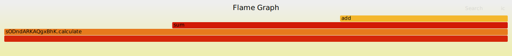

# Simple Tracing Graph Processor

Package stgraph provides a simple tracing graph processor that can be used to generate flamegraphs from structured logs. It reads structured logs from stdin and writes result to stdout in either text or flamegraph formats. Optionally, it can filter traces by trace ID and strip a prefix from the source field.

Use [flamegraph utility](https://github.com/brendangregg/FlameGraph) to generate interactive SVG.

## Usage

```
go run github.com/osbuild/logging/pkg/strc/stgraph -help
```

```
 Usage of stgraph:
  -debug
        enable debug logging
  -filter-trace-id string
        trace ID to filter
  -output-format string
        output format (text/flamegraph) (default "text")
  -root-key string
        root key of the trace (default "span")
  -strip-source-prefix string
        prefix to strip from the source field
  -verbose
        enable verbose logging
```

Copy the raw JSON from below, run stgraph and paste the result into stdin, then hit Ctrl+D to stop processing:

```
go run github.com/osbuild/logging/pkg/strc/stgraph -output-format flamegraph | tee /tmp/graph.unfolded
```

Then install flamegraph utility (package for Fedora available) and run:

```
flamegraph.pl /tmp/graph.unfolded > graph.svg
```

The generated SVG file is interactive and one can drill down the stack with a mouse click, the file needs to be opened in a new browser panel tho:

[](graph.svg)

The data for flamegraph utility are unfolded and the number represents microseconds..

WARNING: The command line utility is currently not designed for long-term use, it does not delete unused data from merge window which are missing root spans which could lead to high memory consumption.

## Example

To see it in action, run the following example:

```
go run github.com/osbuild/logging/internal/example_cli
```

Prints something like:

```
Output format: text
CuGxqNWiQCOCfJc.calculate: 422.794491ms (main.go:45)
  CuGxqNWiQCOCfJc.calculate.sum: 301.606726ms (main.go:36)
    CuGxqNWiQCOCfJc.calculate.sum.add: 120.551163ms (main.go:25)
    CuGxqNWiQCOCfJc.calculate.sum.add: 100.43656ms (main.go:25)
    CuGxqNWiQCOCfJc.calculate.sum.add: 80.471292ms (main.go:25)
  CuGxqNWiQCOCfJc.calculate.sum: 121.038943ms (main.go:36)
    CuGxqNWiQCOCfJc.calculate.sum.add: 60.23402ms (main.go:25)
    CuGxqNWiQCOCfJc.calculate.sum.add: 40.449298ms (main.go:25)
    CuGxqNWiQCOCfJc.calculate.sum.add: 20.185133ms (main.go:25)

Output format: flamegraph
CuGxqNWiQCOCfJc.calculate 422794
CuGxqNWiQCOCfJc.calculate;sum 301606
CuGxqNWiQCOCfJc.calculate;sum;add 120551
CuGxqNWiQCOCfJc.calculate;sum;add 100436
CuGxqNWiQCOCfJc.calculate;sum;add 80471
CuGxqNWiQCOCfJc.calculate;sum 121038
CuGxqNWiQCOCfJc.calculate;sum;add 60234
CuGxqNWiQCOCfJc.calculate;sum;add 40449
CuGxqNWiQCOCfJc.calculate;sum;add 20185
```

## Example raw JSON data

Copy and paste this to the stdin of the `stgraph` to see it in action:

```
{"time":"2025-01-10T15:06:34.506541812+01:00","level":"DEBUG","msg":"span calculate started","span":{"name":"calculate","id":"fgOfXYZ","parent":"0000000","trace":"sODndARKAQgxBhK","source":"/home/lzap/logging/internal/example_cli/main.go:40"}}
{"time":"2025-01-10T15:06:34.506637517+01:00","level":"DEBUG","msg":"span sum started","span":{"name":"sum","id":"yBrTycc","parent":"fgOfXYZ","trace":"sODndARKAQgxBhK","source":"/home/lzap/logging/internal/example_cli/main.go:29"}}
{"time":"2025-01-10T15:06:34.506649239+01:00","level":"DEBUG","msg":"span add started","span":{"name":"add","id":"evFuamd","parent":"yBrTycc","trace":"sODndARKAQgxBhK","source":"/home/lzap/logging/internal/example_cli/main.go:16"}}
{"time":"2025-01-10T15:06:34.527053367+01:00","level":"DEBUG","msg":"span add finished in 20.304867ms","span":{"name":"add","id":"evFuamd","parent":"yBrTycc","trace":"sODndARKAQgxBhK","dur":20304867,"source":"/home/lzap/logging/internal/example_cli/main.go:25"}}
{"time":"2025-01-10T15:06:34.527113463+01:00","level":"DEBUG","msg":"span add started","span":{"name":"add","id":"YaXVSnz","parent":"yBrTycc","trace":"sODndARKAQgxBhK","source":"/home/lzap/logging/internal/example_cli/main.go:16"}}
{"time":"2025-01-10T15:06:34.567556584+01:00","level":"DEBUG","msg":"span add finished in 40.423174ms","span":{"name":"add","id":"YaXVSnz","parent":"yBrTycc","trace":"sODndARKAQgxBhK","dur":40423174,"source":"/home/lzap/logging/internal/example_cli/main.go:25"}}
{"time":"2025-01-10T15:06:34.567575641+01:00","level":"DEBUG","msg":"span add started","span":{"name":"add","id":"CljxKzy","parent":"yBrTycc","trace":"sODndARKAQgxBhK","source":"/home/lzap/logging/internal/example_cli/main.go:16"}}
{"time":"2025-01-10T15:06:34.628012661+01:00","level":"DEBUG","msg":"span add finished in 60.415398ms","span":{"name":"add","id":"CljxKzy","parent":"yBrTycc","trace":"sODndARKAQgxBhK","dur":60415398,"source":"/home/lzap/logging/internal/example_cli/main.go:25"}}
{"time":"2025-01-10T15:06:34.628054879+01:00","level":"DEBUG","msg":"span sum finished in 121.418916ms","span":{"name":"sum","id":"yBrTycc","parent":"fgOfXYZ","trace":"sODndARKAQgxBhK","dur":121418916,"source":"/home/lzap/logging/internal/example_cli/main.go:36"}}
{"time":"2025-01-10T15:06:34.628077122+01:00","level":"DEBUG","msg":"span sum started","span":{"name":"sum","id":"HipBoeF","parent":"fgOfXYZ","trace":"sODndARKAQgxBhK","source":"/home/lzap/logging/internal/example_cli/main.go:29"}}
{"time":"2025-01-10T15:06:34.628081191+01:00","level":"DEBUG","msg":"span add started","span":{"name":"add","id":"LbdMbGY","parent":"HipBoeF","trace":"sODndARKAQgxBhK","source":"/home/lzap/logging/internal/example_cli/main.go:16"}}
{"time":"2025-01-10T15:06:34.708791948+01:00","level":"DEBUG","msg":"span add finished in 80.694499ms","span":{"name":"add","id":"LbdMbGY","parent":"HipBoeF","trace":"sODndARKAQgxBhK","dur":80694499,"source":"/home/lzap/logging/internal/example_cli/main.go:25"}}
{"time":"2025-01-10T15:06:34.708806565+01:00","level":"DEBUG","msg":"span add started","span":{"name":"add","id":"IFTIYQD","parent":"HipBoeF","trace":"sODndARKAQgxBhK","source":"/home/lzap/logging/internal/example_cli/main.go:16"}}
{"time":"2025-01-10T15:06:34.809331072+01:00","level":"DEBUG","msg":"span add finished in 100.49776ms","span":{"name":"add","id":"IFTIYQD","parent":"HipBoeF","trace":"sODndARKAQgxBhK","dur":100497760,"source":"/home/lzap/logging/internal/example_cli/main.go:25"}}
{"time":"2025-01-10T15:06:34.809350304+01:00","level":"DEBUG","msg":"span add started","span":{"name":"add","id":"ZohEDHm","parent":"HipBoeF","trace":"sODndARKAQgxBhK","source":"/home/lzap/logging/internal/example_cli/main.go:16"}}
{"time":"2025-01-10T15:06:34.929733942+01:00","level":"DEBUG","msg":"span add finished in 120.364793ms","span":{"name":"add","id":"ZohEDHm","parent":"HipBoeF","trace":"sODndARKAQgxBhK","dur":120364793,"source":"/home/lzap/logging/internal/example_cli/main.go:25"}}
{"time":"2025-01-10T15:06:34.929751543+01:00","level":"DEBUG","msg":"span sum finished in 301.673407ms","span":{"name":"sum","id":"HipBoeF","parent":"fgOfXYZ","trace":"sODndARKAQgxBhK","dur":301673407,"source":"/home/lzap/logging/internal/example_cli/main.go:36"}}
{"time":"2025-01-10T15:06:34.929802871+01:00","level":"DEBUG","msg":"span calculate finished in 423.291276ms","span":{"name":"calculate","id":"fgOfXYZ","parent":"0000000","trace":"sODndARKAQgxBhK","dur":423291276,"source":"/home/lzap/logging/internal/example_cli/main.go:45"}}
```
